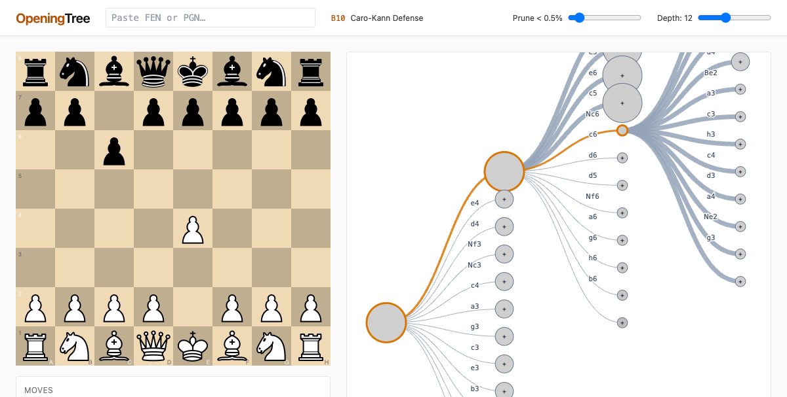

# OpeningTree

A chess opening explorer with a focused, visual **move selection** for the current position: real over-the-board (OTB) games count, average Elo, W/D/B distribution, and the engine of choice for adding more sources later.



## Architecture

```
┌──────────────┐   /api/explorer   ┌──────────────┐   pg COPY/UPSERT   ┌────────────┐
│ React + Vite │ ────────────────▶ │ Fastify + pg │ ────────────────── │ Postgres   │
│  frontend    │ ◀──── JSON ────── │   backend    │                    │ openings db│
└──────────────┘                   └──────────────┘                    └────────────┘
                                          ▲
                                          │ scripts/ingest.ts (streamed PGN parsing,
                                          │ stable-fingerprint dedup, depth-bounded
                                          │ per-edge aggregation)
                                          │
                                  ┌───────┴────────┐
                                  │ PGN data       │
                                  │ (TWIC, Lumbra, │
                                  │  custom dumps) │
                                  └────────────────┘
```

- **Frontend** (this repo's `src/`): React 18 + Vite + TS + Tailwind. Renders a dense, visual `MoveSelection` panel beside an interactive board.
- **Backend** (`server/`): tiny Fastify + node-postgres app exposing `GET /api/explorer?fen=…`. Returns total games, white/draw/black aggregates, and per-move stats (san, games, w/d/b, `avg_elo`, child FEN).
- **Ingestion** (`scripts/ingest.ts`): streams a PGN file, dedupes games via stable fingerprint (`white|black|date|result|event|first-20-plies`), walks the first 16 plies, and UPSERTs `(parent_fen, san)` edges in batched transactions.

## Run

```bash
# 1. Postgres (already installed? skip this)
brew install postgresql@16
brew services start postgresql@16
createdb openings

# 2. Install deps
npm install

# 3. Boot the backend
npm run dev:server     # http://127.0.0.1:5174

# 4. Boot the frontend
npm run dev            # http://localhost:5173
```

## Ingest games

```bash
# Single PGN file
npm run ingest -- data/some-tournament.pgn --source twic1614

# Or with custom depth
npm run ingest -- data/some.pgn --depth 20 --source kingbase
```

The script logs ingestion progress (read / kept / dedupe / no-result / invalid) and is safe to re-run — the dedupe ledger in the `game` table prevents double-counting.

### Where to get OTB PGN

| Source | Size | License | Notes |
| --- | --- | --- | --- |
| [TWIC](https://theweekinchess.com/twic) | ~6–8K games/week | Personal use only | Easiest weekly fetch — `https://theweekinchess.com/zips/twic{N}g.zip` |
| [Lumbra's Gigabase](https://lumbrasgigabase.com/en/) | 10.3M OTB games | CC BY-NC-SA 4.0 | Best canonical source for a public, non-commercial deployment |
| [Caissabase](https://chess-db.com/) | ~3.9M | varies | Recent status unclear; check before relying on it |
| [Lichess Masters Explorer](https://lichess.org/api) | ~2.5M masters games | OAuth-gated 2026 | Smaller than Lumbra, but well-curated |

### Schema

```sql
CREATE TABLE game (
  fingerprint TEXT PRIMARY KEY,    -- sha1 of normalized (white|black|date|result|event|first-20-plies)
  white TEXT, black TEXT,
  white_elo INTEGER, black_elo INTEGER,
  event_date TEXT, result TEXT, source TEXT,
  ingested_at BIGINT NOT NULL
);

CREATE TABLE move (
  parent_fen TEXT NOT NULL,   -- EPD (4 fields)
  san TEXT NOT NULL,
  uci TEXT NOT NULL,
  child_fen TEXT NOT NULL,
  games BIGINT NOT NULL,
  white_wins BIGINT NOT NULL,
  draws BIGINT NOT NULL,
  black_wins BIGINT NOT NULL,
  rating_sum BIGINT NOT NULL,
  rating_n BIGINT NOT NULL,
  PRIMARY KEY (parent_fen, san)
);
```

## Frontend layout

```
src/
├── components/
│   ├── board/        ChessBoard, MoveList
│   ├── explorer/     MoveSelection (the headline), OpeningHeader
│   ├── tree/         NodePreview (mini-board hover, reused)
│   └── ui/           Icon, SearchBar
├── hooks/            useExplorer, useFenUrlSync, useKeyboardNav
├── lib/              cache, lichess (API client), eco
└── store/            gameStore (zustand)
```

The opening-name lookup uses the public [lichess-org/chess-openings](https://github.com/lichess-org/chess-openings) TSVs fetched through a Vite dev proxy (`/api/openings/{a..e}.tsv`).

## Scripts

```bash
npm run dev          # vite dev server
npm run dev:server   # fastify backend (auto-restart)
npm run ingest       # PGN ingestion (see above)
npm run build        # production build
npm run typecheck    # tsc -b --noEmit
npm test             # vitest
npm run e2e          # playwright
```

## Tests

- 16 Vitest unit tests — cache, API client, game store
- 4 Playwright E2E tests — load / play move / FEN search / shareable URL

## Design + plan

`docs/superpowers/specs/2026-05-17-chess-opening-tree-design.md`,
`docs/superpowers/plans/2026-05-17-opening-tree.md`.
